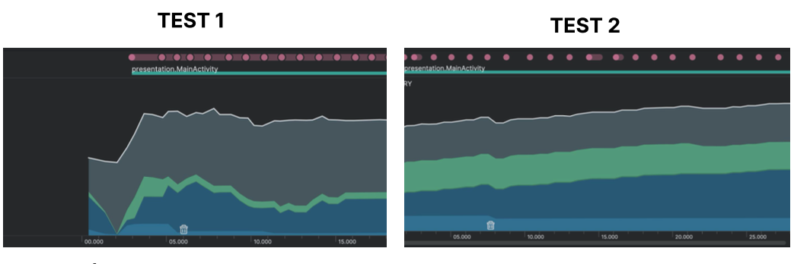

# 안드로이드 이미지 처리

> 소개
>

이 글은 안드로이드 애플리케이션 환경에서 이미지 처리하는 과정에 관해 설명합니다.
이미지 처리 과정에 대한 이해를 돕기 위해 이미지 파일의 종류에 대해 간략하게 소개하고 로딩과 캐싱 방식에 관해 설명합니다.
마지막으로 대표적인 라이브러리 3가지(Glide, Coil, Picasso)에 대해 알아보고 소개합니다.

> 목차
>

1. 이미지 파일 형식
2. 이미지 처리 방식 (로딩, 캐싱)
3. 이미지 로딩 라이브러리
4. 성능 비교
5. 요약 및 마무리

> 이 문서를 읽으면
>

- [ ]  이미지 파일의 종류를 알 수 있어요.
- [ ]  이미지 로딩 방식에 대해 이해할 수 있어요.
- [ ]  이미지 캐싱 방식에 대해 이해할 수 있어요.
- [ ]  이미지 로딩 라이브러리를 이해할 수 있어요.

# 이미지 파일 형식

### 정의

이미지를 디지털 데이터로 저장하고 표현하는 방식을 정의하는 파일 구조를 의미합니다.

### 종류

이미지 파일은 압축 방식에 따라 손실 압축(Lossy Compression)과 무손실 압축(Lossless Compression)으로 구분할 수 있습니다.

- **손실 압축 (Lossy Compression)**

  이미지 품질을 낮추고 파일 크기를 크게 줄이는 방식입니다.

  파일 크기를 줄이기 위해 일부 데이터를 영구적으로 삭제하여 저장하기 때문에 파일 복원 시 일부 정보가 누락됩니다.

  대표적으로 JPEG 이미지 포맷이 손실 압축 방식을 사용합니다.

- **무손실 압축**

  이미지 품질을 유지하면서 데이터를 압축하는 방식입니다.

  원본 데이터를 손실 없이 압축하므로 압축 해제 시 원본 파일과 동일하게 복구됩니다.

  대표적으로 PNG 파일이 비손실 압축 방식을 사용합니다.
  

  ### 이미지 파일의 확장자 예시

    - JPEG
        - 정지 이미지에 사용되는 손실 압축 방식입니다.
        - 이미지 크기를 줄이지만 일부 품질이 손실됩니다.
    - PNG
        - 무손실 압축을 사용하는 이미지 형식입니다.
        - 투명도 지원이 가능합니다.
    - BMP
        - 압축 없이 저장하는 형식입니다.
        - 파일 크기가 크지만 고품질 이미지를 유지합니다.
    - SVG
        - 벡터 그래픽 형식입니다.
        - 크기에 관계없이 이미지 품질을 유지합니다.
    - GIF
        - 256색으로 제한된 이미지를 저장합니다.
        - 짧은 애니메이션과 투명도를 지원합니다.
    - WebP
        - 손실 및 무손실 압축을 모두 지원하는 이미지 형식입니다.
        - 투명도와 애니메이션을 지원하여 PNG와 GIF를 대체할 수 있습니다.
        - 웹에서 사용하기에 적합하며, JPEG와 PNG보다 파일 크기가 작아 페이지 로딩 속도를 개선에 도움이 됩니다.

안드로이드 환경에서도 이미지 파일 형식을 적절히 활용하여 로딩 속도와 이미지 품질을 상황에 맞게 최적화할 수 있습니다.

# 이미지 처리 방식

### 처리 방식


위의 그림과 같이 이미지 처리 방식은 크게 5단계로 구성되어 있습니다.

- **이미지 전처리** : 이미지를 로딩하기 전에 섬네일이나 진행 상황을 보여주기 위한 단계
- **이미지 로딩** : 캐시나 네트워크에서 이미지를 가져오는 단계
- **이미지 디코딩** : 이미지를 비트맵 형식으로 변환하고 크기, 회전, 품질 등을 변환하는 단계
- **이미지 후처리** : 이미지에 애니메이션이나 레이아웃에 맞게 비율 조정하는 단계
- **보여주기** : UI에 표시되는 단계

### 이미지 로딩 및 디코딩 단계


이미지 로딩과 디코딩 과정에서는 외부로부터 이미지를 다운로드하고, 캐시를 활용하여 효율적으로 이미지를 불러옵니다.
이미지 로딩의 흐름을 보면 다음과 같습니다.

1. 메모리 캐시에서 비트맵을 가져옵니다.
   : 먼저 메모리 캐시에 이미지 비트맵이 저장되어 있는지 확인하여, 캐시 히트(cache hit)가 발생하면 바로 비트맵을 불러옵니다.

2. 캐시에 비트맵이 있는 경우(cache hit), 이미지 후 처리 단계로 진행합니다.
   : 메모리 캐시에 비트맵이 있는 경우 캐시에서 이미지를 가져오며, 바로 후처리 단계로 넘어갑니다.

3. 캐시에 비트맵이 없는 경우(cache miss), 디스크 캐시를 확인합니다.
   : 메모리 캐시에 비트맵이 없는 경우, 다음 단계로 디스크 캐시를 확인하여 이미지 파일이 저장되어 있는지 확인합니다.

4. 디스크에 캐시가 있는 경우(cache hit), 디코딩 후 비트맵을 메모리 캐시에 저장하고, 이미지 후처리 단계를 진행합니다.
   : 디스크 캐시에 이미지가 있다면 해당 파일을 디코딩하여 비트맵으로 변환합니다.
   이 비트맵을 메모리 캐시에 저장하여 다음 로딩 속도를 높이고, 이후 이미지 후처리 단계로 이동합니다.

5. 디스크에 캐시가 없는 경우(cache miss), 이미지를 외부 (네트워크,리소스)에서 다운로드합니다.
   : 디스크 캐시에도 이미지가 없는 경우, 외부 소스(네트워크, 리소스 등)에서 이미지를 다운로드합니다.

6. 이미지를 다운로드한 후, 디스크 캐시에 이미지를 저장한다.
   : 다운로드한 이미지를 디스크 캐시에 저장하여, 이후에 동일한 이미지에 접근할 때 빠르게 불러올 수 있도록 합니다.

7. 비트맵으로 디코딩한 후 비트맵을 메모리 캐시에 저장하고 이미지 후처리 단계로 진행한다.
   : 마지막으로, 다운로드한 이미지를 디코딩하여 비트맵으로 변환하고 메모리 캐시에 저장한 뒤 이미지 후처리 단계로 넘어갑니다.

### 이미지 캐싱

네트워크 연결을 통해 한 번 다운로드 한 이미지를 **메모리나** **디스크에** 저장하여, 동일한 이미지를 다시 사용할 때 네트워크를 통해 불러오지 않고 저장된 데이터를 사용해 빠르게 로드할 수 있습니다.

### 캐싱 방식

이미지 캐싱 방식에는 크게 메모리 캐시와 디스크 캐시로 구분할 수 있습니다.

- **메모리 캐시 (Memory Cache)**
    - 앱이 실행 중일 때 이미지를 메모리에 저장해 두고, 다시 로드할 때 빠르게 불러오는 방식입니다.
    - 장점
        - 메모리는 디스크보다 접근 속도가 빠르기 때문에 접근 속도가 빠릅니다.
        - 네트워크나 디스크 I/O를 거치지 않기 때문에 이미지 로딩이 빠릅니다.
    - 단점
        - 한정된 메모리 용량으로 많은 이미지를 캐시하기 어렵다.
        - 앱이 종료되면 캐시 되어 있는 데이터가 삭제됩니다.

- **디스크 캐시 (Disk Cache)**
    - 이미지를 디스크에 저장하여 불러오는 방식입니다.
    - 장점
        - 메모리보다 더 큰 용량을 사용할 수 있기 때문에 많은 이미지를 캐시할 수 있습니다.
        - 앱이 종료되더라도 이미지가 디스크에 남아 있습니다.
    - 단점
        - 디스크 I/O 속도가 메모리보다 느리기 때문에 이미지 로딩 시간이 다소 걸립니다.

메모리 캐시와 디스크 캐시의 장단점이 명확하기 때문에 많은 라이브러리들은 메모리 캐시와 디스크 캐시를 함께 사용합니다.

# 이미지 로딩 라이브러리

### 소개

Glide, Coil, Picasso 같은 이미지 로딩 라이브러리를 사용하면 캐싱 및 로딩을 손쉽게 처리할 수 있습니다.

### Glide 라이브러리

**Glide 사용하기**

- 버전
    - 최소 sdk 버전 14 ( Ice Cream Sandwich ) 이상 사용가능합니다.
    - 최소 sdk 컴파일 버전 27 ( Oreo MR1 ) 이상 사용가능합니다.
- Internet 권한
    - 네트워크에서 이미지를 로드하기 위해 인터넷 권한을 받아야한다.
    - AndroidManifest.xml에 INTERNET 권한 받기

    ```kotlin
    <uses-permission android:name="android.permission.INTERNET" />
    ```

- Gradle 의존성 추가

    ```kotlin
    dependencies {
    	 implementation 'com.github.bumptech.glide:glide:4.14.2'
    }
    ```

**Glide 사용 방식**

- 기본적인 사용 예시

    ```kotlin
    Glide.with(context)
        .load("https://example.com/image.jpg")  // 이미지 URL
        .into(imageView)                        // 이미지를 로드할 ImageView
    ```


- 세부 옵션 이용하기

    ```kotlin
    Glide.with(context)
        .load("https://example.com/image.jpg")
        .placeholder(R.drawable.placeholder)     // 로딩 중일 때 보여줄 이미지
        .error(R.drawable.error_image)           // 로드 실패 시 보여줄 이미지
        .override(300, 300)                      // 이미지 크기 조정
        .circleCrop()                            // 이미지를 원형으로 자르기
        .into(imageView)
    ```


- 캐싱 이용하기

    ```kotlin
    Glide.with(context)
        .load("https://example.com/image.jpg")
        .diskCacheStrategy(DiskCacheStrategy.ALL)  // 디스크 캐시 사용
        .skipMemoryCache(false)                    // 메모리 캐시 사용
        .into(imageView)
    ```

**Glide의 장점**

- 이미지 목록들을 부드럽고 빠르게 스크롤링 가능합니다.
- GIF와 비디오 썸네일을 포함한 다양한 이미지 형식을 지원합니다.
- 비동기 이미지 로딩 및 라이프사이클을 자동으로 관리할 수 있습니다.
- 자동으로 메모리 및 디스크 캐싱을 처리할 수 있습니다.

### Coil 라이브러리

**Coil 사용하기**

- 버전
    - 최소 SDK 버전 21 ( Lollipop ) 이상 사용가능합니다.
- Internet 권한
    - Glide와 마찬가지로 인터넷 권한을 받아야한다.
    - AndroidManifest.xml에 INTERNET 권한 받기

    ```kotlin
    <uses-permission android:name="android.permission.INTERNET" />
    ```

- Gradle 의존성 추가

    ```kotlin
    dependencies {
        implementation 'io.coil-kt:coil:2.7.0'
    }
    ```

**Coil 사용방식**

- 기본 사용 방식
    ```kotlin
        imageView.load("https://example.com/image.jpg") {
            placeholder(R.drawable.placeholder)     // 로딩 중일 때 보여줄 이미지
            error(R.drawable.error_image)           // 로드 실패 시 보여줄 이미지
            size(300, 300)                          // 이미지 크기 조정
            transformations(CircleCropTransformation()) // 원형으로 자르기
        }
    ```

**Coil의 장점**

- Kotlin DSL을 활용하여 코드가 간결하고 읽기 쉽습니다.
- Coroutines을 이용하여 비동기 이미지 로딩을 쉽게 처리할 수 있습니다.
- 최대 2000개의 method 정도로 가볍게 사용할 수 있습니다.

### Picasso 라이브러리

**picasso 사용하기**

- 버전
    - 최소 SDK 버전 21 ( Lollipop ) 이상 사용가능합니다.
- Internet 권한
    - 앞의 두 라이브러리와 마찬가지로 인터넷 권한을 받아야한다.
    - AndroidManifest.xml에 INTERNET 권한 받기
- Gradle 의존성 추가

    ```kotlin
    dependencies {
        implementation 'com.squareup.picasso:picasso:2.8' 
    }
    ```

**picasso 사용방식**

- 기본 사용방식
    ```kotlin
    Picasso.get()
    .load("https://example.com/image.jpg")
    .placeholder(R.drawable.placeholder) // 로딩 중 보여줄 이미지
    .error(R.drawable.error_image)       // 로드 실패 시 보여줄 이미지
    .resize(100, 100) // 크기 조정
    .centerCrop()     // 중앙에 맞추어 자르기
    .into(imageView)
    ```

**picasso 장점**

- 간단한 API를 제공하여 이미지 로드가 편합니다.
- 메모리 및 디스크 캐싱을 자동으로 처리하여 성능을 최적화합니다.
- 이미지 리사이징, 회전, 자르기 등의 간단한 처리가 쉽습니다.

# 성능 비교

### 테스트

Glide, Coil, Picasso 라이브러리를 이용하여 실제 이미지를 로딩했을 때 사용되는 메모리를 측정하였습니다.

### 테스트 환경

- 테스트 폰
    - Pixel4 API 34 버전을 사용했습니다.
- 이미지
    - 1280 * 720 이미지 40장을 사용했습니다.
- Test 1
    - 이미지를 처리 하지 않고 로딩했을 때 메모리 사용량을 측정하였습니다.
- Test 2
    - 이미지를 리사이징 후 로딩했을 때 메모리 사용량을 측정하였습니다.
- 각 테스트에서 **캐싱된 이미지가 남아있을 가능성**을 방지하기 위해 캐시를 무효화(Invalid Cache) 처리하였습니다.

### Glide 테스트

Test1과 Test2에서 Garbage Collection이 1번 등장 하였습니다.

메모리 사용량은 각각 114.8 MB, 118.1MB 정도 사용했습니다.

> 아래의 그림은 테스트 시, 시간에 따른 메모리 사용량을 나타냅니다. (x축 : 시간, y축 : 메모리 , 쓰레기통 모양 : GC)


### **Coil 테스트**

Test1에서는 Garbage Collection이 4번 등장하였으나, 리사이징 처리 후에 2번으로 줄어들었습니다.

메모리 사용량은 각각 103.9MB, 93.2MB 정도 사용했습니다.

> 아래의 그림은 테스트 시, 시간에 따른 메모리 사용량을 나타냅니다. (x축 : 시간, y축 : 메모리 , 쓰레기통 모양 : GC)


### **Picasso 테스트**

Coil과 마찬가지로 Test1에서는 Garbage Collection이 4번 등장하였으나, 리사이징 처리 후에 2번으로 줄어들었습니다.

메모리 사용량은 각각 120.7MB, 101.8MB 정도 사용했습니다.

> 아래의 그림은 테스트 시, 시간에 따른 메모리 사용량을 나타냅니다. (x축 : 시간, y축 : 메모리 , 쓰레기통 모양 : GC)


# 요약 및 마무리

안드로이드 이미지 처리 방식을 알아보기 앞서, 대표적인 이미지 확장자에 대해 알아보았습니다.
이미지 처리를 설명한 후, 어떤 순서로 이미지를 처리하는지 알 수 있었습니다.
이미지 처리 방식을 대표적인 라이브러리 (Glide, Coil, Picasso)에 대해 각 장단점을 알아보고 성능 테스트를 하였습니다.
테스트의 결과가 부정확할 수 있지만, 모든 라이브러리가 Test1(리사이징 전)보다 Test2(리사이징 후)에서 안정적인 메모리 사용량을 보여주었습니다. 

### 참고자료

- 블로그

  https://d2.naver.com/helloworld/429368

- 공식 문서

  https://bumptech.github.io/glide/doc/getting-started.html

  https://coil-kt.github.io/coil/upgrading_to_coil3/

  https://github.com/square/picasso